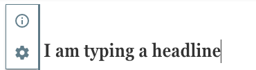
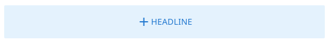
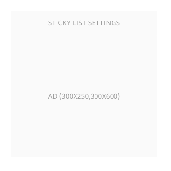
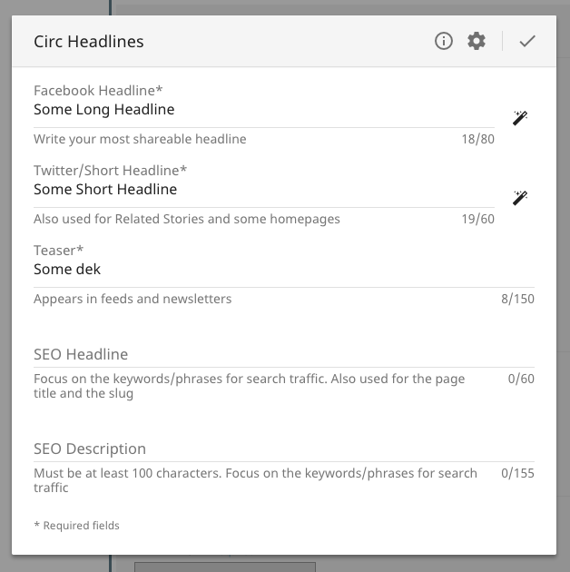
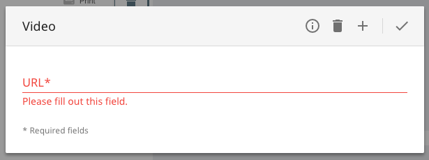
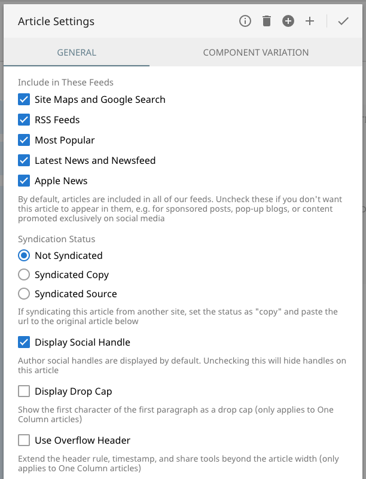
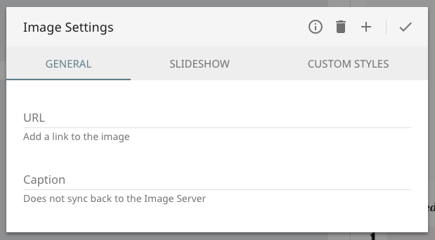
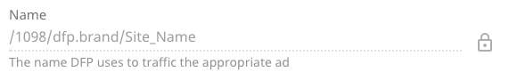
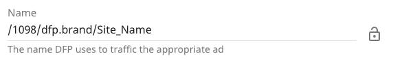
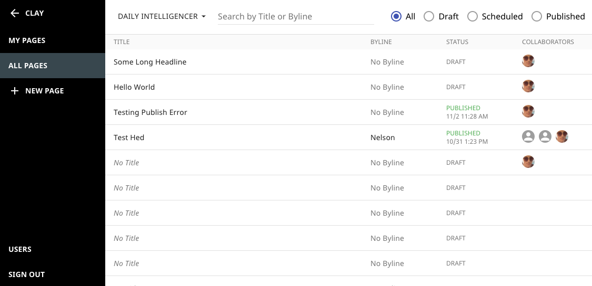

# Editing Components

Components are edited through the fields and forms that are declared in their `schema.yml` file. This means that developers have maximum flexibility with the template and styling of their components, but end users get a consistent and manageable editing experience.

## Inline WYSIWYG

The simplest possible form is an inline WYSIWYG field. It consists of a property in the schema, and a `data-editable` attribute on the editable element in the template.

```yaml
title:
  _has: inline
```

```handlebars
<h1 data-editable="title">{{ title }}</h1>
```

When someone clicks the title, it will open an inline WYSIWYG form. The field will inherit styles from your component, for a proper WYSYWIG experience.



## Placeholders

Placeholders display when fields are empty, and are used to prompt end users to add information. They can be added to any field or group.

```yaml
title:
  _placeholder:
    text: Title
    height: 24px
  _has: text
```

The placeholder will display inside of the element with the relevant `data-editable` attribute.



> #### info::Placeholder Heights
>
> The placeholder height specified in the config is the minimum height of the displayed placeholder. The placeholder will be taller if its parent element has an explicitly set height. When deciding what height to set in the config, remember that it should reflect the height of the content that goes in the field.

### Permanent Placeholders

If you want to display a placeholder for some field, but don't want to allow users to click into it, use the `data-placeholder` attribute. This is useful for situations where a component doesn't have anything to display in edit mode (like ads), but shouldn't be relegated to an invisible component list (like...ads).

You must also add the `permanent` property to the placeholder config to force the placeholder to always display. Permanent placeholders are styled more subtly than regular placeholders, since end users don't click on them to edit anything.

```yaml
adSizes:
  _label: Ad Sizes
  _has: text
  _placeholder:
    text: Ad (${adSizes})
    height: 100px
    permanent: true
```

Placeholders can display the value of a field, which is useful for components not visible during edit mode, e.g. third-party embeds. The syntax for displaying a value in the placeholder text is `${fieldName}`, which is similar to [JavaScript template literals](https://developer.mozilla.org/en-US/docs/Web/JavaScript/Reference/Template_literals). Note that `permanent` must be enabled.



## Editing Components with Forms

Inline WYSIWYG fields can accomplish a lot, but not every bit of data in a component is a string of formatted text. For everything else, there's overlay forms.



Any fields and groups that aren't inline WYSIWYG inputs will display in overlays. Kiln provides an [ever-growing variety of fields](inputs.md) that can be used to edit almost any kind of data you desire. To open these forms, add a `data-editable` attribute on the relevant element and point it to a field or group.

```handlebars
<div data-editable="myField"></div>
```

Overlay forms frequently consist of a single field. This is a perfectly acceptable user experience, because overlay forms will open where the user clicks.



### Groups

For forms with multiple fields, those fields must be combined into groups. A group must have a `fields` property, and may have `_label` and `_placeholder` properties.

```yaml
title:
  _label: Title
  _has: text

url:
  _label: URL
  _has:
    input: text
    type: url

_groups:
  link:
    _label: Link Information
    fields:
      - title
      - url
```

When end users click the `data-editable` attribute that points to this group, it will open an overlay form with all of the group's fields, in order.

```handlebars
<a data-editable="link" href="{{ url }}">{{ title }}</a>
```

### Group Placeholders

If you add a `_placeholder` to a group, you must either make it permanent or specify what fields it should check with `ifEmpty`.

```yaml
_groups:
  link:
    _label: Link Information
    _placeholder:
      text: Link
      height: 24px
      ifEmpty: url
    fields:
      - title
      - url
```

Placeholders in groups may check multiple fields with `ifEmpty`. This is useful for components with editable links, as you'll usually want to display a placeholder when either the url or the link text are empty. Operators are case-insensitive, and you can use `AND`, `OR`, or `XOR`.

```yaml
_groups:
  link:
    _label: Link Information
    _placeholder:
      text: Link
      height: 24px
      ifEmpty: url or title
    fields:
      - title
      - url
```

> #### info::Using XOR
>
> Please note that when comparing _more than two fields_, you cannot use `XOR` (as it's logically impossible to XOR more than two boolean values). For `AND`, `OR`, and `XOR` you must also use the same comparator between each field rather than mixing and matching them.

### Settings Group

The _Component Settings Form_ is a special type of overlay form that's created when you add a group called `settings` to your schema. Components with `settings` groups get a button in their component selector to open the settings form, so don't add `data-editable="settings"` to any elements in the template. Settings groups must not have `_label` (their form will be titled "[Component Name] Settings"), though they may have `_placeholder` (this is useful for permanent placeholders).

```yaml
_groups:
  settings:
    fields:
      - title
      - url
```



> #### info::Head and Invisible Component Settings
>
> Components in `<head>` or invisible lists must have _all_ of their fields available in settings forms, as they don't have any visible elements that can be clicked. The settings forms are accesible from the [Find on Page drawer](manipulating-components.md#head-lists)

Settings forms are useful for `<head>` and invisible components, as well as _optional_ fields that aren't frequently accessed. They're also useful to provide manual fallbacks for automatic component logic, such as fields that are generated in `model.js` files.

### Tabbed Form Sections

Overlay and settings forms may split their fields into tabs. This is useful to group related fields by feature, or to provide a consistent tab for fields that override others. Sections are declared by wrapping the section name in parenthesis in the `fields` property.

```yaml
_groups:
  settings:
    fields:
      - imageUrl
      - caption
      - slideshowType (Slideshow)
      - slideshowLink (Slideshow)
      - slideshowButtonText (Slideshow)
      - sass (Custom Styles)
```

If you specify sections for some fields but leave the other fields blank, they'll be added to a _General_ section. Fields and sections will appear in the form in the order they've been listed.



## Field Configuration

All fields in Kiln have a standard configuration, no matter what kind of input they use. As noted above, the most basic properties of the field config are `_label` and `_has`. These denote the label that appears when looking at the form and what kind of input the field uses. `_has` can be a string (if the input has no arguments) or an object with an `input` property.

```yaml
title:
  _label: Title
  _has: text

url:
  _label: URL
  _has:
    input: text
    type: url
```

### Reveal

Fields may also have a special `_reveal` property, which allows you to hide or show the field based on some data.

```yaml
syndication:
  _label: Article Syndication Type
  _has:
    input: radio
    options:
      - original
      - copy

syndicationUrl:
  _label: Original Article URL
  _has:
    input: text
    type: url
  _reveal:
    field: syndication
    operator: ===
    value: copy
```

In this example, the _Original Article URL_ field would only be displayed if the _Article Syndication Type_ was set to `copy`, since that would mean the article was being syndicated from some other place. You can compare against other fields or even against the site you're on.

* **field** - to compare against, and/or...
* **sites** - to compare against (will be true if the current site is one of them)
* **operator** - optional operator to use for the comparison (defaults to `===`)
* **value** - optional value to compare against

If neither `operator` nor `value` are specified, the field will be shown when the compared field has any data (the same as the `not-empty` operator). The syntax for comparing against sites is the same as [site-specific components in lists](manipulating-components.md#site-specific-components).

**Operators:**

* `===`
* `!==`
* `<`
* `>`
* `<=`
* `>=`
* `typeof`
* `regex`
* `empty` (only checks field data, no value needed)
* `not-empty` (only checks field data, no value needed)
* `truthy` (only checks field data, no value needed)
* `falsy` (only checks field data, no value needed)

> #### info::Deep Field Comparisons
>
> You can compare against deep fields (like `checkbox-group` or `complex-list`) by using dot-separated paths, e.g. `featureTypes.New York Magazine Story`. Don't worry about the spaces, as Kiln will parse it correctly to pull the relevant data.

### Standard Input Arguments

Kiln's inputs are highly customized to the type of data they handle, but there are some shared arguments that work with most inputs.

* **help** - description / helper text for the field, which generally appears below it
* **attachedButton** - an icon button that may be attached to the field, to allow additional functionality
* **validate** - an object that contains pre-publish validation rules:

* **validate.required** - either `true` or an object that described the conditions that should make this field required (using the same properties as `_reveal`)
* **validate.min** - minimum number (for numerical inputs) or length (for text and array inputs) that the field must meet
* **validate.max** - maximum number (for numerical inputs) or length (for text and array inputs) that the field must not exceed
* **validate.pattern** - regex pattern, for text inputs

Validation rules may also have custom error messages, that will appear in the same place as the help text. If you do not specify a message, default error messages will appear.

* **validate.requiredMessage** - will appear when required validation fails
* **validate.minMessage** - will appear when minimum validation fails
* **validate.maxMessage** - will appear when maximum validation fails
* **validate.patternMessage** - will appear when pattern validation fails (very handy to set, as the default message is vague)

Attached buttons are very useful when combined with custom Kiln inputs, but Kiln comes with two built-in: `lock` and `mediaplay-picker`.

**Lock** is a button that disables a field until the user clicks the button. This provides a small amount of friction before editing important (and rarely-edited) fields, similar to macOS's system preferences.

```yaml
adName:
  _label: Name
  _has:
    input: text
    help: The name DFP uses to traffic the appropriate ad
    attachedButton: lock
```



Clicking the lock toggles the input between disabled and enabled state.



**Magic Button** is a button that fetches data, allowing quick population of fields based on other fields, other component data, or the result of api calls.

```yaml
# pull short headline from regular headline
shortHeadline:
  _label: Short Headline
  _has:
    input: wysiwyg
    attachedButton:
      name: magic-button
      field: headline

# pull feed image from first image component
feedImage:
  _label: Feed Image
  _has:
    input: text
    type: url
    attachedButton:
      name: magic-button
      component: image
      transform: getComponentInstance
      url: $SITE_PREFIX
      property: url

# pull image caption from image management server's api
caption:
  _label: Image Caption
  _has:
    input: text
    attachedButton:
      name: magic-button
      field: url
      url: http://my-image-api.biz/
      property: metadata.caption
```

For more information about `magic-button`, [please see its specific documentation](inputs.md#magic-button).

> #### info::Multiple Attached Buttons
>
> Inputs may include multiple attached buttons, but be warned that this does take up horizontal space from the main input. For this reason, more than two attached buttons on a single input is not recommended.
>
> ```
> attachedButton:
>   - lock
>   - name: magic-button
>     field: title
> ```

## Cross Component Communication

Components can affect other components on the page by publishing and subscribing to properties (such as `title`, `description`, `ledeImage`, etc). This allows many-to-many communication in Kiln, as multiple components can publish or subscribe to the same property, and components can publish or subscribe to multiple different properties. There are no restrictions on pubsub property names, so be sure to avoid unintended collisions!

### Publishing

To publish to a property, add `_publish` to your field. The component will send data to that property _after_ their `model.save()` logic is run (if they have any). This allows that component to perform logic before propagating its data, such as generating extra fields.

```yaml
# non-user-editable fields, set by model.js and used for pubsub
plaintextTitle:
  _publish: pageTitle
  _has:
    help: Plaintext page title, set by seoHeadline, shortHeadline, or primaryHeadline.
```

### Subscribing

Components that want to subscribe to properties should have `_subscribe` on the field(s) they want to update, with the name of the property it should subscribe to. Subscribed properties will trigger a component to save, thus allowing the subscribed component's `model.save()` method to do logic on the incoming data before it's sent to the server.

```yaml
ogTitle:
  _subscribe: pageTitle
  _label: OG:Title
  _has: text
```

### PubSub Tips

Kiln intelligently prevents a component from publishing more than once during pubsub, so you may safely create circular pubsub logic. For example, a `tags` component may update an `article`'s `primaryTag` field, and the `article` may also allow editing of that field (and propagating those changes back to `tags`).

As cross-component updating is a feature of Kiln, it only works client-side. For third-party microservices or manual API calls, please make use of [cascading PUTs](https://github.com/nymag/amphora/pull/73) to affect multiple components.

If you have data you want to propagate when publishing (which happens server-side), have your [publishing service](http://clay.github.io/amphora/docs/basics/publishing.html) add that data to the locals object, which will be passed in to all components' `model.save()` method.

### Kiln Subscribers

Kiln itself subscribes to a few specific properties, which it uses to update its index of pages. Publishing to `kilnTitle` will update the page title, and `kilnAuthors` will update the page authors. You can see the results in the Clay Menu.


